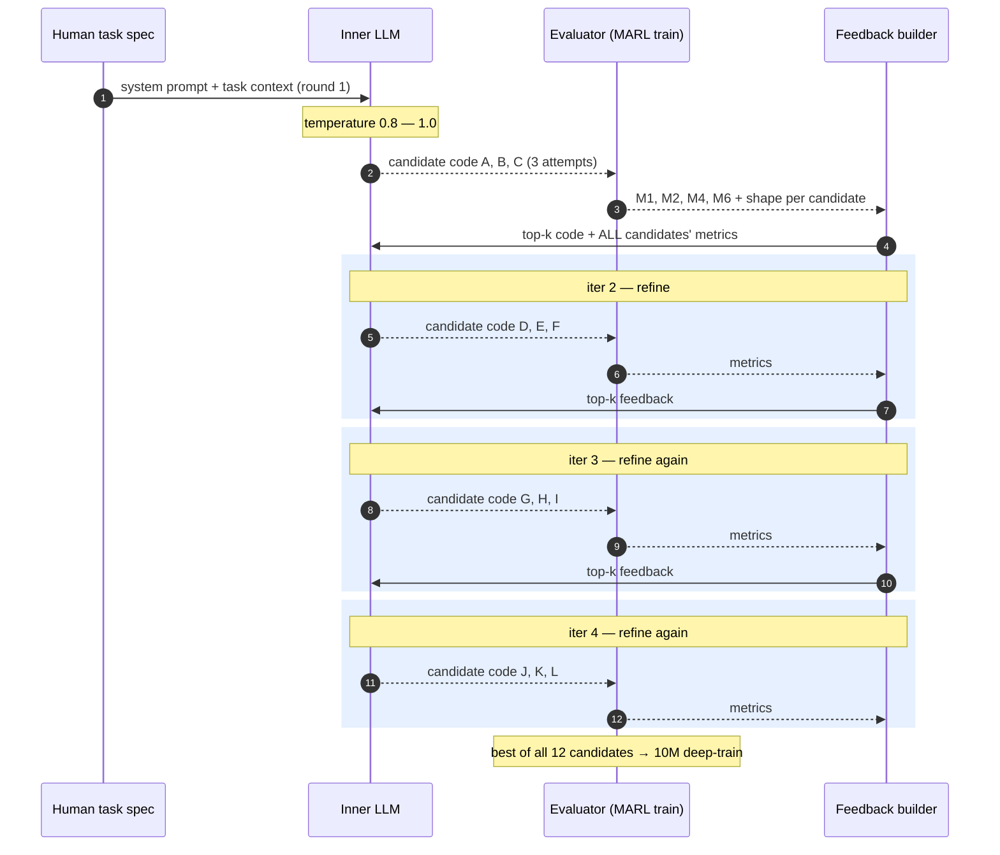
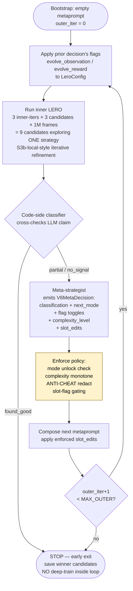

# Learning Communication Protocols for Multi-Robot Rendezvous — The Story So Far

> *A narrative tour of the experiments, from the hand-crafted baselines that defined the bar, through the LLM-driven attempts that climbed it, to the meta-prompt experiments now trying to rediscover what worked without cheating.*

This document is a story. It starts at the highest level — what the project is about — then descends into the parameters, the failures, and the few breakthroughs. It complements `all_experiments_analysis.md` (which is the table-heavy reference) and `prompt_evolution_analysis.md` (which is the prompt-content audit). Read this first if you want to understand the arc; read the others for the receipts.

---

## 1. The central question

Four agents share a 2×2 unit square. Four targets are placed somewhere inside it. The agents are told nothing about where the targets are, who their teammates are, or whether a target has already been "covered." All they have is a ring of LiDAR rays around themselves and a velocity. To win, **exactly two agents must be within `covering_range` of the same target at the same instant**. With four agents and four targets, the unique solution is two pairs splitting up to two distinct targets and holding position until the simulator counts the cover.

This is a task that humans can solve in their head — "split up into pairs, each pair takes a target." It is a task that *individual* RL training learns at maybe 40–70% success, depending on tricks. And it is a task that — until we discovered the right experimental recipe — entirely defeated LLM-driven reward engineering, even when the same algorithm trivially solved related single-agent variants.

The central question of the project is: **what kind of help does an LLM actually offer a multi-agent reinforcement learner?** Reward design? Observation design? Strategy proposal? And under what conditions does each kind of help survive contact with millions of frames of policy gradient?

The short answer, derived empirically from ~25 experiments and four meta-prompt iterations, is **observation design**. The long answer is the rest of this document.

The full arc looks like this:

```mermaid
flowchart LR
    Start([Hand-crafted policies, no LLM])
    ER1[ER1 — no comm<br/>M1 = 0.405]
    ER2[ER2 — broadcast/proximity comm<br/>M1 = 0.46 - 0.53]
    ER3[ER3 — GNN GATv2<br/>M1 = 0.71]
    LERO_REWARD[LERO paper-faithful<br/>evolve_reward = true<br/>M1 = 0.08 - 0.10<br/>reward-hacked]
    S3B[S3b-local<br/>evolve_reward = false<br/>M1 = 0.845 mean]
    META[LERO-MP / v4 / v4.1 / B' / v5<br/>meta-prompt over evolve_reward = true<br/>M1 = 0.01 - 0.24]
    V6([v6 — current<br/>simplicity-first meta + obs-only<br/>+ anti-cheat<br/>running now])

    Start --> ER1 --> ER2 --> ER3
    ER3 -. ceiling 71% .-> LERO_REWARD
    LERO_REWARD -. reward hacking .-> S3B
    S3B -. how to remove human prompt? .-> META
    META -. complexity on top of zero-signal noise .-> V6

    classDef win fill:#d4edda,stroke:#28a745,color:#000;
    classDef loss fill:#f8d7da,stroke:#dc3545,color:#000;
    classDef neutral fill:#fff3cd,stroke:#ffc107,color:#000;
    classDef pending fill:#cce5ff,stroke:#004085,color:#000;
    class ER1,ER2,ER3 neutral;
    class LERO_REWARD,META loss;
    class S3B win;
    class V6 pending;
```



---

## 2. The environment in detail

All experiments run in **VMAS** (Vectorized Multi-Agent Simulator), a PyTorch-based 2D physics simulator. The specific scenario is **Discovery**.

### Field and entities

- **Arena**: continuous 2D, bounded by `[-1, 1] × [-1, 1]` — i.e. a 2-unit square.
- **Agents**: 4 unit-mass disks with holonomic dynamics (continuous force in xy applied each step). Each agent's action space is 2D continuous force. Agents collide elastically with each other and with arena walls.
- **Targets**: 4 fixed landmarks, randomly placed at the start of every episode. Targets do NOT respawn after being covered (`targets_respawn: false` is a hard requirement — it's what makes M1 and M3 well-defined).
- **Covering rule**: a target counts as "covered" when **exactly `agents_per_target=2` agents are within `covering_range` of it simultaneously**. Once covered the target is removed (no respawn). Episode ends when all 4 targets are covered or `max_steps` is reached.

### Sensors

Each agent has two LiDAR rings:

- **Entity LiDAR**: 15 rays evenly spaced around the agent (24° apart), each returning the **distance to the nearest target** in that ray's direction. Range: 0.35 (ray returns its max if nothing in range).
- **Agent LiDAR**: 12 rays returning distance to the nearest **other agent** (when `use_agent_lidar: true`).

These are the *only* spatial signals each agent has. Agents do **not** observe absolute target positions, other agents' positions, or which targets have already been covered. The whole project lives on top of this local-observation constraint.

### Step / episode budget

- Each call to the env advances one physics step (`dt=0.1`s in scenario time).
- Episode terminates at `max_steps` steps OR when all targets covered.
- Two main task variants:
  - **Easy**: `max_steps=200`, `covering_range=0.35` (used in early ER1/ER2 exploration and v4 LERO-MP)
  - **Hard**: `max_steps=400`, `covering_range=0.25` (the S3b-local / B' / v5 / v6 setting). Larger episode budget, smaller cover radius — harder coordination because agents must hold position more precisely.

### How much space does an agent traverse per step?

VMAS Discovery integrates with **2 substeps of semi-implicit Euler + drag** (verified in `vmas/simulator/core.py:_integrate_state`):

```
# Once per macro step (substep 0):
v ← v · (1 − drag)   # drag = 0.25 → v ← v · 0.75

# Twice per macro step (substep 0 and 1, sub_dt = 0.05):
v   ← v + (force / mass) · sub_dt   # force ∈ [−1, 1], mass = 1
pos ← pos + v · sub_dt
```

What this gives concretely:

| quantity | value |
|---|---|
| Per-step displacement at full sustained thrust | **0.04 units** ≈ **2% of arena width** |
| Steady-state max speed | `v_ss = 0.4 unit/s` |
| Time to cross the 2-unit arena from rest under sustained max thrust | **~50 steps** (= 5 sim-seconds) |
| Expected per-step displacement under a *random* (untrained) policy | only **~0.009 units** (drag damps the velocity random-walk) |
| Expected NET displacement of a random agent after 200 steps | **~0.13 units** (random walk: `√(N · σ²)`) |

That last number is the load-bearing fact for understanding why the task is hard:

- Initial mean agent-target separation: **~1 unit** (uniform placement in 2×2 arena, 4 targets)
- LiDAR range: **0.35 units**
- A random-policy agent therefore rarely sees a target via LiDAR within an episode — it would need to traverse ~0.65 units net to enter LiDAR range, but its expected net displacement after 200 random steps is only ~0.13.

This is why feature-rich observations work so well in this regime: features like S3b-local's `dir_x = cos(angle_of_smallest_lidar_ray)` give the policy a direction-to-target the *instant* it stumbles within LiDAR range, instead of forcing it to learn that direction from raw 15-ray vectors over millions of frames. A small piece of LLM-designed observation engineering replaces millions of frames of random exploration.

### Reward (when hand-crafted)

- `agent_collision_penalty: -0.01` per collision per step (auto-applied by physics)
- `time_penalty: -0.01` per step
- `covering_rew_coeff: 1.0` — coefficient of the per-step covering reward
- `shared_reward: true` — the team reward is summed over all agents and broadcast (so individual agents don't get individual credit)

### Why these specific parameters?

The numbers above are not arbitrary. `covering_range=0.25` is empirically the smallest radius at which the task is solvable in 400 steps but hard enough that a "wander toward nearest blob" policy fails. `lidar_range=0.35` gives agents enough lookahead to plan but not enough to spot all 4 targets at once from any starting position.

---

## 3. The training algorithm: MAPPO

All experiments use **Multi-Agent PPO (MAPPO)** with shared policy parameters across agents (CTDE — centralized training, decentralized execution). The code is BenchMARL on top of TorchRL.

| hyperparameter | value | reason |
|---|---|---|
| `share_policy_params` | `true` | All 4 agents share the same actor network — symmetry is built into the task |
| `gamma` | 0.99 | standard for episodic continuous-control |
| `lmbda` (GAE) | 0.95 | standard variance/bias tradeoff |
| `lr` | 5e-5 | low — multi-agent training is brittle to LR; verified in ER1 ablations |
| `on_policy_collected_frames_per_batch` | 60000 | one PPO iteration's rollout buffer |
| `on_policy_n_envs_per_worker` | 600 | parallel-env count; trades wall vs memory |
| `on_policy_n_minibatch_iters` | 45 | PPO epochs per rollout — high to extract signal from on-policy data |
| `on_policy_minibatch_size` | 4096 | minibatch within each PPO epoch |
| `train_device` / `sampling_device` | `cpu` | task tensor sizes are small; CPU is faster than GPU launch overhead |
| `evaluation_interval` | 120000 frames | eval every two PPO iters |
| `evaluation_episodes` | 200 (or 100) | enough for low-variance M1 estimate |

A "full training run" is **10 000 000 frames** ≈ **167 PPO iterations** ≈ **1.5h on V100S** (CPU-bound) or **~1.7h on M2 Pro Mac**.

This is the unit of compute behind every "experiment" cited in the rest of this doc. A fresh, randomly-initialized 4-agent MAPPO policy gets 10M frames, then we measure its post-training success rate (M1) with a separate 100-episode evaluation rollout of the saved best policy.

---

## 4. The metrics

Eleven indicators are tracked but two carry the headline:

- **M1 — success rate**: fraction of evaluation episodes where all 4 targets get covered before `max_steps`. The single most important number; the project's North Star.
- **M6 — coverage progress**: average fraction of targets covered at episode end (vs full success only counted in M1). M6 distinguishes "got close" from "got nothing" — crucial when M1 is sub-threshold.

Other metrics: M2 average return (noisy, dominated by penalties), M3 episode length (lower is better when M1>0), M4 collisions, M5 communication tokens (only ER2/ER3), M8 agent utilization, M9 spatial spread.

When you see "M1 = 0.88" later in this doc, it means *88% of evaluation episodes were full-success.*

---

## 5. The hand-crafted baselines: ER1, ER2, ER3

Before any LLMs entered the picture, three families of human-designed solutions established the bar.

### ER1 — no communication, hand-crafted reward

The simplest setup: every agent observes only its own pos/vel + LiDAR. No comm channel. Reward is a hand-designed shaping that combines covering reward + per-step penalties + reward shaping for "moving toward unoccupied targets."

| variant | M1 (k=2, ms=400, cr=0.25) | notes |
|---|---|---|
| Baseline | 0.405 | no agent LiDAR, generic reward |
| + agent LiDAR | 0.405 | agent LiDAR alone doesn't help — needs paired reward shaping |
| + LP+SR (limit-progress + spread-reward) | 0.405 | this is the standard ER1 hyperparameter set quoted in the project |
| + ablation studies (entropy, lr, λ, network size, training length) | 0–6% delta | none meaningfully changed the baseline; exhausted the easy hyperparameter axes |

ER1's 40.5% is the floor. It means roughly four-out-of-ten episodes resolve to a perfect 2+2 pair coverage; the rest collapse to redundant clumping or wandering.

### ER2 — engineered communication

Adds a continuous broadcast channel: every agent emits a `dim_c`-dimensional vector each step that nearby agents receive in their observation.

| variant | M1 |
|---|---|
| Broadcast comm (`dim_c=8`) | 0.46 |
| Proximity comm (`dim_c=8`, restricted by lidar_range) | 0.53 |

Proximity comm beats broadcast — restricting messages to nearby agents acts as a free coordination prior. Both variants need careful reward shaping (LP+SR) on top.

### ER3 — GNN-based communication

The most sophisticated baseline. Replaces the broadcast channel with a learned **GATv2** graph attention layer that exchanges messages between agents during forward pass.

| variant | M1 |
|---|---|
| GATv2 ms=400 | **0.71** |

This is the strongest hand-designed result in the project. The GNN learns *what to communicate* during training; the human still designs the reward and the graph topology.

### The hand-crafted ceiling

The pattern across ER1 → ER2 → ER3 is: more sophisticated communication helps, but plateaus at ~71%. None of these surpass the structural threshold where the policy genuinely "understands" the coordination problem. They incrementally help.

The LERO experiments below are an attempt to break this ceiling.

---

## 6. LERO — the paper algorithm

**LERO** (LLM-driven Evolutionary Reward & Observation, [arXiv:2503.21807](https://arxiv.org/abs/2503.21807)) introduced an evolutionary loop in which an LLM iteratively writes Python observation/reward code, the code is evaluated by short MARL training runs, and the LLM sees the per-iteration metrics + best code on the next iteration.

### The paper's algorithm

```
For each iteration k = 1..K (=4):
    1. LLM generates N (=2) candidate (HRF, OEF) pairs given task context + best-so-far code + metrics
    2. Each candidate is evaluated via short MARL training (30k steps)
    3. Selector ranks candidates by cumulative reward / convergence speed / success rate
    4. Top-k candidates' code + metrics fed back into LLM for iteration k+1

After K iterations, deep-train the global-best candidate to convergence.
```

Paper-faithful settings: K=4, N=2, 30k frames per candidate. Joint reward+observation evolution. LLM = OpenAI o3-mini. Task = MPE Simple Spread / Reference (k=1, single-agent-per-landmark).

Visualized as a sequence diagram (S3b-local uses the same loop, just at K=4, N=3, 1M frames per candidate):



### Sanity check: LERO works on paper-like k=1 tasks

Before declaring "the algorithm fails on k=2", we needed to confirm that our infrastructure faithfully reproduces the paper's behavior on the regime the paper actually tested — single-agent-per-landmark coordination. We ran LERO on two k=1 task variants in VMAS Discovery (analogous to MPE Simple Spread):

| variant | n_agents | n_targets | k | hand-crafted ER1 | LERO obs+reward |
|---|---:|---:|---:|---:|---:|
| Easy spread | 2 | 4 | 1 | 0.580 | **1.000** |
| Tighter spread | 3 | 3 | 1 | 0.660 | **1.000** |
| ER1 baseline (n=4 t=4 k=1) | 4 | 4 | 1 | 0.768 | — |

LERO hits **M1 = 1.000 on both k=1 variants**, beating ER1 by 30+ percentage points on the same task. This matches the paper's MPE results and confirms the LERO loop, the LLM client, the patched-scenario plumbing, and the reward/observation injection are all working correctly.

**Why k=1 is easy for LLM reward design**: when each target needs exactly one agent, individual rationality coincides with collective rationality. An agent that maximizes its own progress toward an unoccupied target also helps the team. The LLM-designed reward typically adds an `all_covered` completion bonus + sharper proximity shaping that ER1 lacked — and there's no exploit channel because no exploit *is* a strategy that hurts the team. The policy and the reward agree on what good looks like.

This sanity-check matters: it shows the upcoming k=2 failures are a real property of harder coordination tasks, not a code bug.

### Initial port to VMAS Discovery — the failures

Direct ports of the paper algorithm to k=2 Discovery rendezvous were attempted in 2026-04. They failed catastrophically.

| run | task | outcome |
|---|---|---|
| S1, S2 (reward only) | k=2 cr=0.25 ms=400 | M1 ≈ 0 — diverging losses |
| S3 (paper-faithful, both evolve) | k=2 | M1 ≈ 0.105 — *eval-vs-final degradation* |
| S3a (gpt-5.4-mini) | k=2 | M1 ≈ 0.090 |
| S3a_gpt5 (full gpt-5.4) | k=2 | M1 ≈ 0.090 — eval M1=0.86 collapses to 0.09 at 10M |
| S3ac (with comm channel) | k=2 | M1 ≈ 0.080 — comm amplified the failure |

The pattern was consistent across LLM models, prompts, and minor algorithm variations. **The LLM-evolved reward systematically introduces "reward shortcuts" — anti-crowding penalties, per-agent approach bonuses, magnitude inflation — that look smart at 1M-frame eval but become exploitable at 10M.** The policy converts the shortcut into an oscillating or peak-collapse strategy that no longer accomplishes the actual k=2 rendezvous goal.

This isn't a code bug. It's a property of the joint-reward-evolution regime: LLM credit assignment for true multi-agent coordination is not its strong suit.

### The breakthrough: S3b-local

S3b-local was a deliberate deviation from the paper. The single change: **`evolve_reward = false`**. The LLM only evolves the observation function; the reward stays fixed at the hand-crafted ER1 baseline.

This broke the deadlock.

| seed | post-eval M1 (10M deep-train) | peak in-train | gap |
|---|---:|---:|---:|
| s0 | 0.885 | 0.930 | 0.045 |
| s1 | 0.820 | 0.925 | 0.105 |
| s2 | 0.830 | 0.945 | 0.115 |
| **mean** | **0.845** | **0.933** | **0.088** |

(3-seed replication done 2026-04-29.)

**0.845 mean post-eval. Tight cluster across seeds.** This is the new state-of-the-art on this task. It surpasses ER3 GNN (0.71) by 13 percentage points without using any communication channel — just LLM-designed observation features built from the same LiDAR sensor data the GNN consumes.

#### Why obs-only works where reward-evolution failed

Observations are *read-only*. The policy cannot game what it sees; it can only choose how to act. Whatever feature combination the LLM exposes, the policy's training objective is still the unchanged hand-crafted reward — which is *known to be non-exploitable*. So adding richer observations can only help (or at worst be ignored), it cannot create a new exploit channel.

Reward, by contrast, is the optimization target. Any flaw in the reward becomes the policy's strategy. With 10M frames, the policy will find any flaw that exists. LLMs writing rewards introduce flaws.

This is the **Feature Engineering vs Incentive Design** thesis: LLMs are good at the former, unreliable at the latter. The S3b-local result is the empirical proof.

#### What the LLM actually invented

S3b-local's 10M-trained best policy used a 28-feature observation function the inner LERO loop evolved over 4 iterations. The breakthrough features (named `hold_signal`, `approach_signal`, `crowd_signal`, `sparsity_signal` in the final code) are products of `lidar_targets` × `lidar_agents` masking — the LLM realized that **a target near AND a teammate near** means "stay" while **a target near AND no teammate near** means "approach." These are pre-computed coordination decisions that a hand-designed observation never had. The full feature anatomy is in `all_experiments_analysis.md` § "S3b-local — full trajectory analysis".

---

## 7. The novelty of S3b-local vs the LERO paper

S3b-local *is* the LERO algorithm — same iterative loop, same top-k feedback, same code+metrics conditioning of subsequent generations. What changed is the configuration:

| | LERO paper | S3b-local |
|---|---|---|
| Task | MPE Simple Spread (k=1) | VMAS Discovery (k=2) |
| `evolve_reward` | true (jointly with obs) | **false** (single-variable change) |
| Eval frames per candidate | 30 000 | **1 000 000** (33× more) |
| `obs_state_mode` | global (oracle) | **local** (lidar only — fair vs ER1/ER2/ER3) |
| LLM | OpenAI o3-mini | gpt-5.4-mini |

The single load-bearing deviation is `evolve_reward=false`. The 1M eval budget grew because Discovery's PPO needs longer to escape early flat phases than MPE Simple Spread does. The local obs mode is for fairness against the hand-crafted baselines.

**Stated as a thesis sentence**: *the LERO paper showed iterative LLM-driven evolution works on simple coordination (k=1 MPE); we show that on hard coordination (k=2 Discovery) the paper's joint reward+obs evolution fails by reward-hacking, but the obs-only restriction succeeds and surpasses the strongest hand-crafted baseline by 13pp.*

---

## 8. The meta-prompt quest: LERO-MP / v4 / v5

S3b-local proved the task is solvable. But it relied on a hand-curated prompt (`v2_fewshot_k2_local`) — a real human had to write the system prompt, the LiDAR-inference hints, and a starter fewshot. The natural next question: **can an outer LLM rediscover such a prompt, so the human is removed from the loop?**

This was the LERO-MP / v4 / v5 line of work.

### LERO-MP v3 (2026-04-22)

First pass: an outer LLM mutates the inner prompt across rounds, with each round running a small inner LERO search. On the *easy* task (cr=0.35, ms=200) it produced 6–10× peak sample efficiency vs ER1 — but **all 3 seeds collapsed by 10M frames** with ~50% peak-to-final gaps. The reward was still being co-evolved; reward-hacking returned.

### v4 / v4.1 / B' (2026-04-26 → 2026-04-28)

Successive refinements: bootstrap meta-LLM call, multi-strategy fanout (3 strategies per round), 1M inner eval (B'), strategist JSON-parse retry. Across 4 seeds on the hard cr=0.25 / ms=400 task, mean post-eval M1 = **0.238** (B'). Better than v4 baseline (0.117) but still 3.5× below S3b-local's 0.845.

The diagnostic: at 1M-frame inner eval, every reward-evolution candidate scores M1=0 — the inner LERO can't filter reward-hacks because they don't manifest until much later in training. Meta-strategy on top of zero signal is noise.

### v5 (2026-04-28)

A more sophisticated architecture: textual-gradient meta-loop with best+worst candidate code shown to the meta-LLM, cumulative tried-and-failed registry, stagnation detection that triggers a forced pivot prompt. Mac-run, 1 seed: post-eval **M1 = 0.010**. Worse than v4. Same root cause: meta-strategy is downstream of inner-fitness signal, and `evolve_reward=true` ensures inner-fitness is uniformly zero.

### The lesson

**Architectural complexity on top of `evolve_reward=true` does not close the reward-hacking gap. It amplifies the noise.** v3 / v4 / B' / v5 = ~€150 of OVH spend + 1 Mac overnight, total. The clearest finding of the project per cost-of-evidence.

The corollary: future LERO-MP-style work on coordination tasks should keep `evolve_reward=false` and use the meta-layer to evolve the *observation prompt* only.

---

## 9. v6 — the current attempt

v6 is the experiment running as this document is being written.

### Goal

Have the meta-LLM rediscover an S3b-local-quality coordination prompt **without cheating** — without the developer typing the answer features into the source code, configs, or prompt templates. Validation = the inner loop reaches S3b-local's signal threshold (M1 ≥ 0.05 with monotonic_rise shape).

### Anti-cheat boundaries

- **Source-level**: a grep over `src/lero/v6/`, `configs/lero_v6/`, `run_lero_v6.py`, and the new base template returns zero hits for the S3b-local-winning feature names (`hold_signal`, `approach_signal`, `crowd_signal`, `sparsity_signal`, `gap_to_partner`, `pair_formation_zone`, `nearest_unassigned`, etc.).
- **Runtime**: the meta-LLM's slot-edit text is scanned at decision-time; any forbidden token is replaced with `<REDACTED>` and an `enforcement_notes` entry records the violation. Two-layer defense.

### Architecture (v6)



In pseudocode:

```python
metaprompt_v0 = empty bootstrap
for outer_iter in 0..MAX_OUTER:
    base_loop.lero.evolve_observation = prior_decision.next_evolve_observation
    base_loop.lero.evolve_reward = prior_decision.next_evolve_reward
    inner = run_inner_loop(metaprompt_v_iter, 3 × 3 × 1M)
    code_class = classify_inner_result(inner)
    if code_class == "found_good": break
    raw = meta_strategist(...)
    decision = enforce_decision(raw, code_classification=code_class)
    metaprompt_v_{iter+1} = apply slot_edits(metaprompt_v_iter, decision.slot_edits)
# deep_train_winner() is implemented but commented out in the runner
```

### Design principles

1. **Simplicity-first**. Outer iter 0 is locked to `evolve_observation=true, evolve_reward=false` (the simplicity-first prior — the same mode that worked for S3b-local). Reward unlocks only when the meta-LLM justifies it via an `add_simple_reward` decision and the prior classification supports it.
2. **One strategy per outer iter**. The metaprompt slot text is fixed for the duration of the inner LERO loop; all 9 inner candidates explore the same single strategy. Inner iterative feedback refines the *implementation* of that strategy.
3. **Reflection-driven escalation**. Complexity_level (1–4) is monotone-increasing unless the meta-LLM explicitly chooses `reset_simpler`.
4. **Code-side classification wins**. The runtime computes its own classification from raw inner metrics; if the meta-LLM claims `found_good` but the code disagrees, the code wins. Prevents the meta-LLM from gaming the early-stop condition.
5. **No deep-train inside the loop**. v6 isolates the variable we're testing (does the meta-strategy reach S3b-local-quality inner signal?) from the confounder (did a 10M deep-train get lucky after the meta-strategy failed?). Once a `found_good` candidate is identified, deep-train is a separate gated step.

### Current run (in progress)

Reduced budget: `max_outer=2, n_inner_iter=3, n_inner_candidates_per_iter=3, eval_frames=1M`. 18 candidates max per seed, ~2.5h on M2 Pro Mac. Single seed for the first datapoint; replicate to 3 seeds if the result is interesting.

### What we're looking for

| outcome | interpretation |
|---|---|
| `found_good` triggers in outer 0 (M1 ≥ 0.05 + monotonic_rise) | Meta-LLM rediscovered a working prompt on first try with simplest strategy. Strong positive — implies the meta layer is viable as a human-prompt-engineer replacement. |
| `found_good` triggers in outer 1 after a no_signal_simple → try_different_simple step | Meta-LLM needed one round of reflection to find the right direction. Still positive. |
| Both outer iters end `no_signal_simple` | The meta-LLM's simplest strategies don't escape flat_zero. Suggests further outer iters or a relaxed threshold are needed; or the prompt floor is too weak. |
| `add_simple_reward` triggers and inner shows `peak_collapse` | Reward evolution returned and reintroduced the v4/v5 failure mode. Tells us reward should stay frozen. |

If v6 reaches `found_good`, we then run a separate 10M deep-train of the winner inner candidate and compare to S3b-local's 0.845. Match = the meta-layer works without cheating. Below S3b-local = the meta-layer is partial; the human-curated prompt still has irreplaceable structure.

---

## 10. Open questions

A few things this experimental program has *not* answered yet:

1. **Is S3b-local's prompt itself avoidable by the meta-LLM?** The 4-feature starter fewshot in `v2_fewshot_k2_local` is borderline by v6's strict anti-cheat definition. v6's base template includes only a 1-feature anchor. Whether the 1-feature anchor is enough for the inner LLM to reach S3b-local-quality code is an empirical question v6 will answer.
2. **Does meta-search add value at all once `evolve_reward=false`?** Maybe the entire LERO-MP / v4 / v5 / v6 line is a sophisticated way of replicating what 4 inner LERO iterations on a hand-curated prompt already do. v6's apples-to-apples comparison vs S3b-local will tell us.
3. **Are there harder coordination tasks where the meta-layer becomes necessary?** k=2 with 4 agents and 4 targets is solved by S3b-local. k=3 (three agents per target), heterogeneous agents, or larger target counts might require the meta-layer to get over a planning hurdle that single-prompt LERO can't.
4. **Is the LERO paper's joint-reward-evolution salvageable on harder tasks via reward-hacking detection?** A reward variant could be re-evaluated at deeper training (5M, 10M) before being accepted. Cost vs payoff TBD.

These are the questions the next experiments will go after.

---

## 11. The chronology, condensed

```
2026-03-22  ER1 baseline established. M1=0.405 on k=2 cr=0.25 ms=400.
2026-03-25  ER2 broadcast comm. M1=0.46.
2026-03-28  ER2 proximity comm. M1=0.53.
2026-04-05  ER3 GATv2. M1=0.71.

2026-04-15  LERO ports begin. S1, S2, S3, S3a, S3a_gpt5, S3ac all hit 0.08–0.10
            on k=2 — reward evolution reward-hacks consistently.

2026-04-19  S3b-local (evolve_reward=false). M1=0.88 on first seed.
2026-04-22  LERO-MP v3 (online meta-prompting). 6–10× peak sample-efficiency
            but 10M-collapse on all 3 seeds.

2026-04-26  LERO-MP v4 / v4.1. Mean M1=0.117 on cr=0.35 task.
2026-04-27  B' (v4 with 1M inner, hard task). Mean M1=0.238 across 3 seeds.
2026-04-28  v5 textual-gradient. Single seed M1=0.010 on Mac.

2026-04-29  S3b-local 3-seed replication: 0.885 / 0.820 / 0.830, mean 0.845.
            Confirmed not a single-seed outlier.
2026-04-29  v6 launched (Mac, 2 outer × 3 inner × 3 cands × 1M).
            Anti-cheat at source + runtime. Goal: rediscover S3b-local
            quality through simplicity-first meta-strategy.

2026-04-29  This document written, while v6 is mid-run.
```

The next chapter is whatever v6 finds.

---

## Appendix: file index

- `docs/all_experiments_analysis.md` — table-heavy quantitative reference for all experiments
- `docs/prompt_evolution_analysis.md` — prompt-content audit, S3b-local vs v5/v6 prompts side-by-side
- `docs/v6_plan.md` — v6 architecture plan + anti-cheat boundary definitions
- `docs/lero.md` — LERO infrastructure reference and paper-deviation log
- `src/lero/v5/` — v5 implementation (textual-gradient meta-loop)
- `src/lero/v6/` — v6 implementation (simplicity-first, single-strategy, anti-cheat)
- `configs/lero/s3b_local.yaml` — the breakthrough config
- `configs/lero_v6/rendezvous_k2_2x3.yaml` — v6 reduced-budget run config
