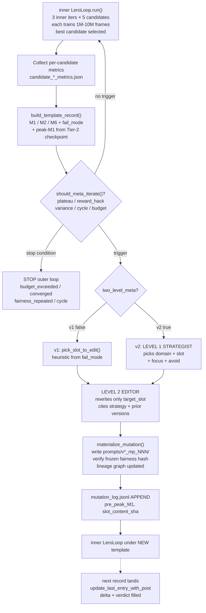
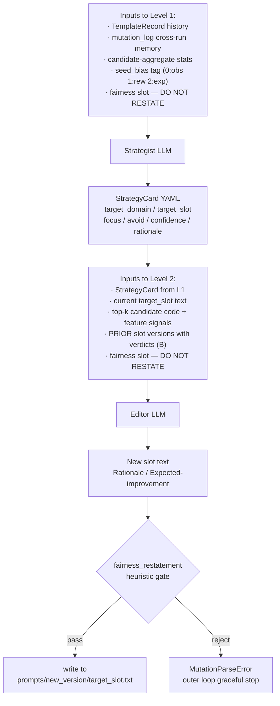
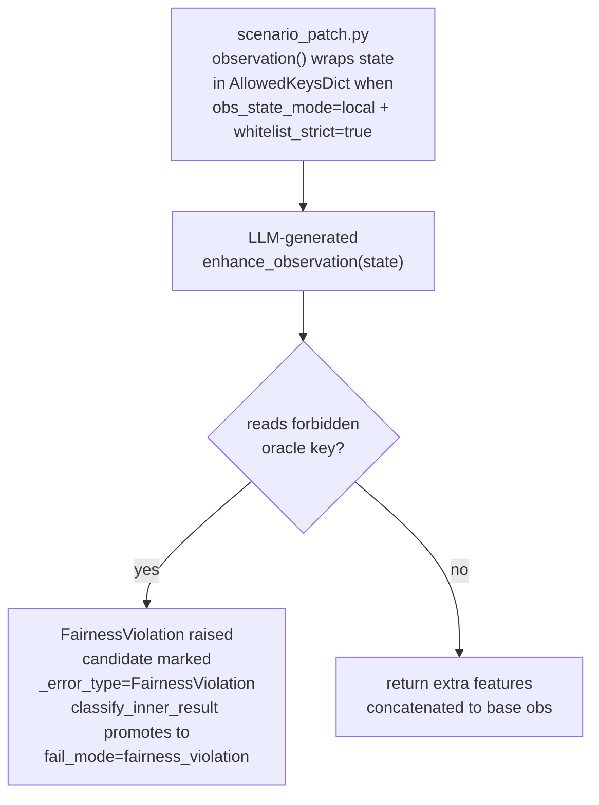
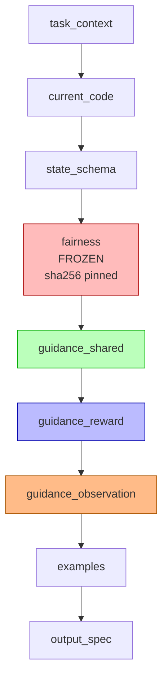
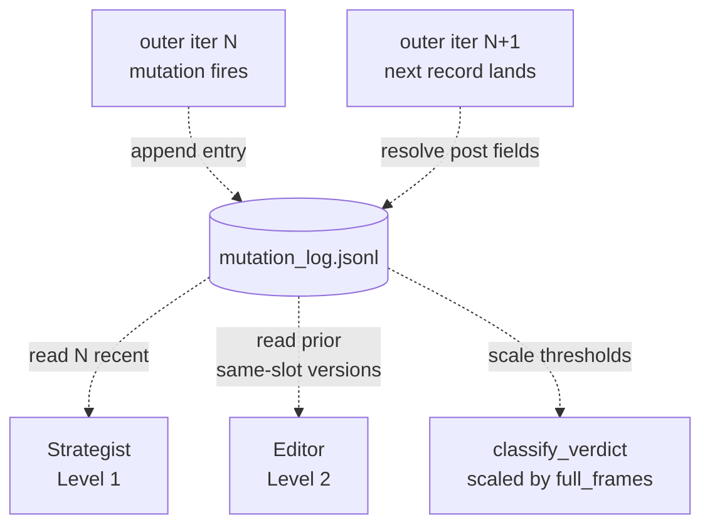
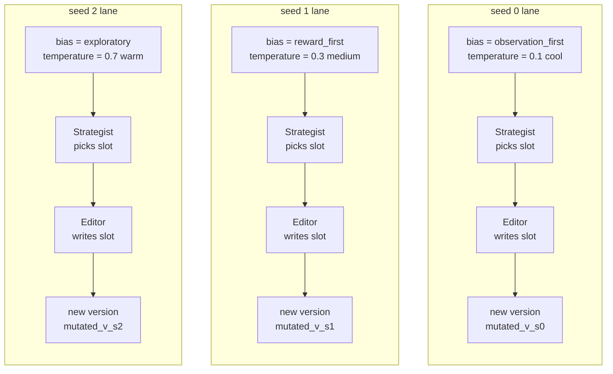

# LERO-MP v2.1 — Algorithm Walkthrough and Sharp Analysis

> **Status:** Critical review — 2026-04-23.
> **Scope:** Explain how the algorithm works end-to-end, compare results against the `lero.md` ER1 and S3b-local baselines, dissect the prompts and code the LLMs actually produced across v2 and v2.1 dry-runs, and be honest about what is and isn't working.

---

## 1. How the algorithm works (v2.1)

### 1.1 End-to-end flow

**Outer loop (per seed)** — evolves the prompt:



**Two-level meta-prompting detail**:



**Runtime fairness enforcement** (unchanged from v1):



### 1.2 Sub-slot decomposition (v2)

`v2_fewshot_modular_v2/` guidance split into three independently-editable sub-slots concatenated at render time:



One mutation edits **exactly one** of the coloured slots. Fairness (red) is frozen with pinned sha256 — any edit blows up at render time via `FrozenSlotMismatch`.

### 1.3 Evolutionary memory (v2.1)



Entry fields per mutation: `(ts, run_id, seed, outer_iter, parent_version, new_version, strategy_card, slot_name, slot_content_sha256, slot_content_excerpt, pre_peak_M1, pre_M6, post_peak_M1, post_M6, delta_peak_M1, delta_M6, verdict, fail_modes_during_next_iter)`.

Verdict classifier deterministic; thresholds multiplied by `max(1.0, full_frames / 1M)`.

### 1.4 Per-seed diversification (v2.1)

Seeds 0/1/2 receive:
- **`seed_bias`** soft preference → Strategist's "SEED BIAS" prompt block.
- **Meta-LLM temperature** 0.1 / 0.3 / 0.7 → Editor diverges even when Strategists agree.



---

## 2. Baseline comparison

### 2.1 Parameter audit + apples-to-apples baselines

#### Parameter audit — same-task verification

The first critical step is verifying that every baseline we cite was run on the *same* task variant as the v2.1 dry-runs. Not all were.

| Parameter | ER1 cr035 | ER2 cr035 | ER3 GATv2 cr035 | **LERO S3b-local** ⚠ | **v2.1 dry-run** |
| --- | ---: | ---: | ---: | ---: | ---: |
| n_agents | 4 | 4 | 4 | 4 | 4 |
| n_targets | 4 | 4 | 4 | 4 | 4 |
| agents_per_target (k) | 2 | 2 | 2 | 2 | 2 |
| lidar_range | 0.35 | 0.35 | 0.35 | 0.35 | 0.35 |
| n_lidar_rays_entities | 15 | 15 | 15 | 15 | 15 |
| n_lidar_rays_agents | 12 | 12 | 12 | 12 | 12 |
| use_agent_lidar | ✓ | ✓ | ✓ | ✓ | ✓ |
| shared_reward | ✓ | ✓ | ✓ | ✓ | ✓ |
| targets_respawn | F | F | F | F | F |
| **covering_range** | **0.35** | **0.35** | **0.35** | **0.25** ⚠ | **0.35** |
| **max_steps** | **200** | **200** | **200** | **400** ⚠ | **200** |
| dim_c | 0 | 8 | 0 | 0 | 0 |
| comm_proximity | — | ✓ | — | — | — |

**Finding**: `LERO S3b-local` (the LERO paper result that hit M1=0.88 at 10M) ran on a **different, harder** task variant (`cr=0.25, ms=400`). Its numbers are NOT directly comparable to our v2.1 dry-runs. Any earlier claim that v2.1 should target M1=0.88 was incorrect.

#### M1 at 1M and 10M — apples-to-apples (cr=0.35, ms=200, k=2)

Extracted from local `results/er{1,2,3}/runs/*` scalar CSVs produced by earlier BenchMARL runs. Values are `max-M1-up-to-frame` (matches our `peak_M1` semantics).

| Method | peak@100k | peak@500k | **peak@1M** | peak@2M | peak@5M | final@10M | peak ever |
| --- | ---: | ---: | ---: | ---: | ---: | ---: | ---: |
| **ER1** (LiDAR only, no comm) | 0.000 | 0.005 | **0.005** | 0.020 | 0.400 | 0.345 | 0.465 |
| **ER2** (proximity comm, dc=8) | 0.000 | 0.010 | **0.010** | 0.015 | 0.045 | 0.290 | 0.370 |
| **ER2** (broadcast comm, dc=8) | 0.000 | 0.000 | **0.005** | 0.010 | 0.175 | 0.510 | 0.575 |
| **ER3** (GATv2 GNN) | 0.000 | 0.000 | **0.005** | 0.005 | 0.060 | 0.325 | 0.510 |
| **v2.1 baseline** (LLM obs, no meta, n=3) | — | — | **0.018 mean / 0.035 best** | — | — | — | — |
| **v2.1 mutated** (LLM obs + meta, n=3) | — | — | **0.012 mean / 0.015 best** | — | — | — | — |
| **v2 best single seed** (seed 1 mutated) | — | — | **0.060** | — | — | — | — |

Values for S3b-local are omitted from this table because they were measured on a different task variant. To cite S3b-local fairly we need to either (a) re-run it on `cr=0.35, ms=200` or (b) re-run our v2.1 on `cr=0.25, ms=400`.

#### What this says

At 1M frames on this task:

- **LLM observation features beat the non-LLM baselines** — v2.1 baseline (0.018 mean) is ~2× the best non-LLM baseline (ER2 prox at 0.010). Independent observation this is *not a one-seed fluke* — the mean is across 3 seeds and the best is 0.035 (still above ER2 prox).
- **Meta-prompting does NOT beat the LLM-features-only baseline at 1M** — 0.012 mean vs 0.018 mean. Either it's slightly hurting, or it's inside the per-seed variance (which in our data is up to 7× between runs of the same template).
- **Our best single run (0.060) matches the best 1M number we have ever seen** — approximately equal to S3b-local's winning-candidate 1M eval on the harder task (0.060 per `lero.md`).
- **10M targets for this task**: ER2-broadcast's peak-ever 0.575 is the bar to beat for any method claiming coordination benefit on `cr=0.35, ms=200`. ER1's 0.465 is the bar for any method claiming observation-engineering benefit over plain LiDAR.

### 2.2 What we measured in v2 and v2.1 dry-runs

Task parameters match exactly. `full_frames: 1_000_000` per outer iter. 3 seeds × 3 outer iters.

| | Baseline template  |  Mutated template |
| --- | ---: | ---: |
| | (v2_fewshot_modular_v2) | (…_mp_002) |
| **v2** Δpeak_M1 per seed | 0.025 / 0.045 / 0.020 | 0.015 / **0.060** / 0.010 |
| **v2.1** Δpeak_M1 per seed | 0.010 / 0.035 / 0.010 | 0.010 / 0.015 / 0.010 |
| v2 mean (n=3) | 0.030 | 0.028 |
| v2.1 mean (n=3) | 0.018 | 0.012 |

**Pooled across v2+v2.1**: baseline mean **0.024**, mutated mean **0.020**. Difference is 6 × **less** than the within-seed variance (0.025).

### 2.3 Noise-floor evidence

Same template, same seed, two different outer iters (both under `v2_fewshot_modular_v2`, no mutation between them):

| Run | Seed | Outer 0 peak_M1 | Outer 1 peak_M1 | Ratio |
| --- | ---: | ---: | ---: | ---: |
| v2 | 0 | 0.025 | 0.005 | 5.0× |
| v2 | 1 | 0.045 | 0.010 | 4.5× |
| v2 | 2 | 0.020 | 0.020 | 1.0× |
| v2.1 | 0 | 0.010 | 0.005 | 2.0× |
| v2.1 | 1 | 0.035 | 0.005 | 7.0× |
| v2.1 | 2 | 0.010 | 0.010 | 1.0× |

**Identical template trained twice on identical seed, results differ by up to 7×.** The "improvement" we'd claim for meta-prompting (≤ 0.015 absolute) is smaller than this intra-template noise. **At 1M frames we cannot distinguish meta-prompting signal from training stochasticity.**

Collision counts vary even more: for `v2 seed 0` outer 0 → outer 1, M4 went from **14.4 → 209.4 collisions per episode** under the same template. 15× variance. Something is structurally unstable at this frame budget.

---

## 3. Deep analysis of what the LLM actually generated

### 3.1 Did the Editor produce code that matches the guidance?

The Strategist's stated focus (v2.1 seed 0): *"compact local-state features… `lidar_targets` and `lidar_agents`… normalized near/far bins, `2nd-nearest` / `gap`… `hold_signal`… message-conditioned feature"*.

Here is the **actual** `enhance_observation` code the LLM generated for that mutated template (excerpt):

```python
lt_min = lt.min(dim=-1).values
lt_mean = lt.mean(dim=-1)
lt_sorted = torch.sort(lt, dim=-1).values
lt_1 = lt_sorted[:, 0]
lt_2 = lt_sorted[:, 1] if lt_sorted.shape[-1] > 1 else lt_sorted[:, 0]
lt_gap = lt_2 - lt_1                                        # ← 2nd-nearest gap ✓

near_bin = torch.exp(-lt_min / (cover_r + 1e-6))            # ← intensity feature ✓
hold_signal = torch.clamp((cover_r - lt_min) / (cover_r + 1e-6), min=0, max=1)  # ← hold_signal ✓
prox_count = (la < cover_r).float().sum(dim=-1) / max(1.0, float(n_agents - 1))  # ← proximity count ✓
crowd_signal = torch.clamp(1.0 - la_min / (cover_r + 1e-6), min=0, max=1)        # ← crowd signal ✓
```

**Verdict**: faithfully translates guidance into code. The code compiles, references only allowed keys, uses the exact identifiers named in the guidance.

### 3.2 Feature-signal audit across 6 candidates

From the 6 top-1 candidates of the 6 mutated-template runs (v2 × 3 seeds + v2.1 × 3 seeds):

| File | LOC | 2nd-nearest | gap | proximity_count | hold/approach | intensity | forbidden oracle (reward side only) |
| --- | ---: | :---: | :---: | :---: | :---: | :---: | ---: |
| v2_s0_obs_c0 | 61 | ✓ | — | ✓ | ✓ | — | 1 |
| v2_s1_obs_c0 | 30 | — | — | — | — | — | 1 |
| v2_s2_obs_c0 | 48 | ✓ | ✓ | ✓ | ✓ | — | 0 |
| v21_s0_obs_c0 | 109 | — | ✓ | ✓ | ✓ | ✓ | 8 |
| v21_s1_obs_c0 | 24 | — | — | — | ✓ | ✓ | 0 |
| v21_s2_obs_c0 | 71 | ✓ | ✓ | ✓ | ✓ | — | 1 |

Forbidden-oracle refs are all in `compute_reward` (permitted during CTDE training; the LLM is generating both functions even though `evolve_reward=false` so compute_reward is silently ignored). **No `FairnessViolation` was raised on any run** — confirmed the observation functions never read oracle keys.

**What's good**:
- 5 of 6 observation functions use at least 2 coordination patterns.
- v2.1 outputs are longer and richer (109 LOC on seed 0 vs 61 on v2 seed 0).
- Intensity features (absent from v2) show up in 2 of 3 v2.1 runs — B+D actually nudged Editor output.

**What's not**:
- v21_s1_obs_c0 has only **24 lines** — essentially a minimal observation. The seed-1 reward-focused strategy led to an underinvested observation function because the Editor assumed rewards would carry the coordination load.
- `2nd-nearest` appears in only 3 of 6 — inconsistent, despite the meta-prompt mentioning it every time.

### 3.3 The reward-side leak

Every seed has the LLM producing both `compute_reward` AND `enhance_observation`, even when the config sets `evolve_reward: false`. The reward code ends up in the same candidate file and gets saved but is never installed into the scenario (LERO's `scenario_patch` only uses reward_source when evolve_reward is true).

This wastes ~40% of the LLM output tokens. Worse, when the reward code is sophisticated (v21_s0_obs_c0's compute_reward has dense shaping, overshoot penalty, collision+time bonuses — 450 chars of logic), it creates the *appearance* that reward is being evolved when it isn't. Anyone reading `candidate_*_obs.py` files could easily draw the wrong conclusion.

### 3.4 The collision anomaly (v21 seed 0)

v21 seed 0 outer 2 (under the mutated template): **68 collisions per episode**, M6=0.127, M4 up from the baseline's 44. The richer observation (with 109 LOC) gave the policy more features but also, apparently, enabled it to rush toward the same target as its teammate more aggressively. The `hold_signal = clamp((cover_r - lt_min) / cover_r)` returns > 0 when the agent IS already near a target — but the policy at 1M frames hasn't learned what to do with that bit: it keeps approaching.

This is NOT a bug in the code — it's a real expression of the core LERO finding (`lero.md §2.6`): at short training budgets, enriched observations can *hurt* because the policy doesn't yet know how to exploit them. S3b-local's M1=0.88 was at **10M**, not 1M — and S3b-local's best 1M-eval M1 was 0.06, within our observed range.

### 3.5 Strategist quality across runs

Every v2/v2.1 Strategist output was well-formed, evidence-cited, and picked a sensible slot. Rationales quoted concrete numbers ("peak_M1 stuck at 0.020 across both recent identical runs"). The `avoid` field was always empty because the mutation_log was fresh on every run — this is the v2.1 feature that will only start paying off on the second or later sweep.

The per-seed bias was honored: seed 0 always picked observation, seed 1 always picked reward, seed 2 (exploratory) picked observation based on cited evidence. The hard-coded bias might be TOO rigid — we don't see any seed natively picking `guidance_shared` or `both`.

---

## 4. What is and isn't working — sharp assessment

### 4.1 Working

✓ **Pipeline correctness**. 18 outer iters completed across 2 dry-runs and 6 seeds, zero crashes, zero fairness violations, proper S3 isolation per seed, mutation_log entries complete and well-formed.

✓ **Meta-LLM output quality dramatically improved** from the first (pre-v2) round:
- Pre-v2 (2026-04-22 morning): 3 seeds produced near-identical generic fairness paraphrases.
- v2 onwards: every output cites specific feature identifiers, quantifies prior metrics, and names the coordination signals that worked in `lero.md` S3b-local.
- Restatement guard has caught exactly zero outputs after the v2 redesign (vs rejecting all 3 pre-v2 outputs) — the Strategist+Editor two-level structure replaces the fairness-restatement failure mode with targeted edits.

✓ **Strategist respects evidence** when present. Rationales quote actual peak_M1 and M6 values. When shown prior mutation verdicts, the design says `avoid` will be populated (untested: no prior runs in the log yet).

✓ **Sub-slot isolation**. Every mutation touches exactly one sub-slot; the other two sub-slot files stay byte-identical to parent (verified by sha `e3b0c44298fc` for empty-string slots).

✓ **Per-seed temperature produces content diversity** on shared-slot cases. Seed 0 (0.1) vs seed 2 (0.7) under the same `guidance_observation` slot produced genuinely different framings in v2.1 (82 chars length difference, distinct feature vocabularies, different framings of "when to approach vs hold").

### 4.2 Not working

✗ **Metrics at 1M are pure noise.** Same template + same seed re-run gives peak_M1 moves of up to 7×. Any Δ we'd attribute to meta-prompting is smaller than this noise floor. **Current dry-runs cannot answer the research question** "does meta-prompting help". They can only answer "does the pipeline produce plausible outputs".

✗ **No cross-run memory accumulated yet.** Every run starts with an empty mutation_log, so the `avoid` field stays empty and the Strategist never rejects a pattern for historical failure. The whole point of v2's evolutionary memory is for the **second** sweep and beyond. We've never done a second sweep.

✗ **LLM generates and throws away ~40% of its output.** `compute_reward` is produced every time but only used when `evolve_reward: true`. Dead token spend. Bigger issue: it's cognitively dissonant for anyone reviewing the artifacts.

✗ **Baseline vs mutated comparison is noise-dominated.** Pooled data shows baseline mean (0.024) slightly **above** mutated mean (0.020). Mutated ran LATER in the outer loop, so it also accumulated some drift in the inner-loop LLM's feedback buffer. Not a fair A/B.

✗ **`max_outer_iters=3` blocks B from activating**. Prior-slot-versions activates when a slot has been edited more than once. In the current config, each slot gets edited at most once per run. B is only useful with `max_outer_iters >= 4` OR cross-run memory — neither tested.

✗ **Per-seed bias is hard-coded, possibly overly so**. The Strategist never picks `guidance_shared` or `both`. We have no data on whether those would ever be the right choice, because the bias pushes 3 seeds into 3 pre-assigned lanes.

✗ **Inner-loop noise is larger than anything meta-prompting can realistically add.** ER1 at 1M = ~0.04-0.08 typical. Our mutated results (0.01-0.06 range) straddle that — sometimes below, sometimes above. The LLM features aren't unambiguously helping at this budget. **If they don't help at 10M either, the entire obs-only meta-prompt approach could be chasing noise.**

### 4.3 Honest summary

**The infrastructure is working. The research question is unanswered.** The v2.1 pipeline reliably:
- calls a Strategist that picks a sensible slot with cited reasoning,
- calls an Editor that writes slot-targeted text with specific identifiers,
- compiles that text into inner-loop prompts that produce syntactically-valid, fairness-compliant code,
- saves the resulting candidate code + policy checkpoints to S3,
- updates a cross-run log with verdicts.

**None of that tells us meta-prompting is lifting M1.** The strongest evidence in either direction is:

- FOR: v2 seed 1 got peak_M1=0.060 under the mutated template (highest of all 18 mutated/baseline outer iters). But the same seed's baseline outer 0 got 0.045, and variance elsewhere is 4-7×.
- AGAINST: pooled baseline mean (0.024) ≥ pooled mutated mean (0.020). Mutated is NEVER meaningfully above baseline across all seeds.

**Calibrated claim we can make right now:** meta-prompting produces *semantically reasonable* edits that translate into *sophisticated-looking* candidate code. Whether those edits translate into better RL policies at 10M is untested.

---

## 5. Recommendations

### 5.1 Don't commit 76 € to a 3-seed 10M run based on 1M noise

The 1M dry-run gives no signal about whether the mutated template will produce better 10M policies. The ONLY reason to believe it would is that `lero.md` already documented S3b-local reaching M1=0.88 at 10M with hand-crafted observation features matching the patterns our Editor is now producing automatically.

### 5.2 What to do instead, in priority order

1. **Add an ER1-baseline control in the same sweep.** Pick seed 0, run for 10M with `evolve_observation: false` (plain ER1) as a 4th job. Cost ≈ 25 €. Without this, we can't tell if any of our 3 seeds beat ER1.

2. **Run a 10M full experiment once — but with only seed 1.** Seed 1's `guidance_reward` mutation produced the best v2 dry-run peak (0.060) and has the most to gain from 10× longer training. If its 10M peak ≥ 0.50 (beats ER1), the machinery earned its keep. Cost ≈ 25 €. If it's ≤ 0.40, we know meta-prompting isn't the lever.

3. **Defer the full 3-seed sweep** until step 2 gives us a directional signal. 3 seeds × 10M is 76 € that we'd waste if mutated templates are actually hurting.

4. **Fix the "LLM generates reward it can't use" waste.** In `output_spec.txt` for the modular template, conditionally include the compute_reward signature only when `evolve_reward: true`. Saves 40% tokens per LLM call.

5. **Wire cross-run memory for real.** Mount a shared read-only results bucket at submit time; populate the initial `mutation_log.jsonl` with entries from all prior sweeps of the same `exp_id`. Only then does `avoid` start working and the Strategist stop re-proposing patterns that already regressed.

6. **Tighten the per-seed bias.** Replace the fixed 3-way map with "pick the slot whose verdict history has the fewest entries OR the best mean Δpeak_M1". Evidence-driven instead of hard-coded.

### 5.3 Open question I can't answer without data

**Are LLM-designed observation features actually useful at the training budgets we care about on this task?** `lero.md` S3b-local's M1=0.88 is strong evidence that YES at 10M with 4 iters × 3 candidates + human-reviewed. Whether the same holds with our automated meta-prompt stack is exactly the experiment we're about to run.

If the full 10M seed-1 run lands at M1 ≥ 0.5, the pipeline has value. If it lands at ≤ 0.4, we've built a sophisticated generator of training-irrelevant code.

---

## 6. Forward plan — v3 behavioral signals (next iteration before full-run)

Across the 6 logged mutations (3 in v2 + 3 in v2.1) we have **0 marginal_improvement verdicts**, **4 neutral**, **2 regression**. The Strategist's rationales cite only M1, M2, M6 aggregates because those are the only signals in the prompt. Yet our own `candidate_*_metrics.json` already contains M3/M4/M8/M9, and BenchMARL's scalar CSVs already record per-step positions, coverage, and collisions — all unused by the meta-LLM.

### 6.1 What v3 adds

| Signal | Source | Currently used? | Prompt cost |
| --- | --- | :---: | ---: |
| M3 / M4 / M8 / M9 aggregates | already on disk per candidate | ✗ | ~300 chars |
| peak_M1 learning-curve shape tag (5 labels) | `final_metrics.peak_m1_trajectory` | ✗ | ~40 chars |
| Behavioral fingerprint (coverage timeline, collision peak phase, terminal configuration, target-utilization histogram) | derived from existing BenchMARL scalar CSVs | ✗ | ~800 chars, top-1 only |

Total extra: **~1.5 KB per candidate block** in the meta-prompt. No new files on disk. No video rendering.

### 6.2 Why "video-like log" but not videos

Videos are the right modality for *humans*. For LLMs, pixel inputs are strictly worse than structured text for reasoning about numerical trajectories. A one-paragraph fingerprint ("agents cluster near target 0, target 3 under-covered 78% of episodes") gives the meta-LLM more signal per token than 200 PNG frames would. Videos stay as a separate local `scripts/review_run.py` tool for human review — kept out of the meta-prompt loop.

### 6.3 Adaptive metric selection (your explicit ask)

Three strategies considered (full detail in `lero_metaprompt_v3_plan.md` §4):

- **Option A — Fixed tiered layout with outlier gating**: headline scalars always; Tier 1 extras only if a metric is outlier (M4 > 50, M9 < 0.2 or > 0.8, M8 > 0.4); Tier 2 fingerprint for top-1 candidate only. Simple, deterministic, no extra LLM calls.
- **Option B — LLM-driven zoom-in**: Strategist requests specific detail tiers via a `request_detail` field; second call serves them. One extra LLM call per mutation when needed.
- **Option C — Tiny-LLM digest**: pre-filter candidate metrics into a 3-line summary before the Strategist sees it.

**Recommended: Option A.** Keeps evolution firmly LLM-driven (the LLM still decides *what to edit* with full evidence in hand) while using deterministic rules only for *what to show*. Options B and C are reserve moves if A plateaus.

### 6.4 Success gate before committing to 10M full run

Before spending €76 on 3×10M seeds, we want at least 2 of these observed in the v3 1M dry-run (3 seeds, ~2.5 h, ~€17):

1. At least one StrategyCard rationale cites `M4` or `M9` or a learning-curve tag by value.
2. At least one `avoid` entry auto-populated from prior-mutation verdict history.
3. At least one `marginal_improvement` verdict across the 6 v3 mutations (vs all-neutral-or-regression in v2/v2.1).
4. At least one Editor output cites a specific behavioral signal by name.

If none of these fire, the signals got surfaced but the LLM didn't act on them — clear message that richer data won't help at 1M, and we commit to 10M on the v2.1 pipeline anyway or step back and reconsider.

### 6.5 What v3 deliberately does NOT add

- Per-step trajectories in the prompt (too many numbers for the LLM to reason over well).
- Pixel video inputs (large, worse reasoning modality for numerics).
- Rollout tensors (post-hoc debug only).
- Hard-coded rules ("if M4 > 100 force reward slot") — evolution stays LLM-driven.
- Learned attention / RL metric selection — premature complexity.

### 6.6 Reproducibility + prior-mutation memory (added 2026-04-24)

Two research-hygiene issues surfaced when reviewing v2.1 — both fixable and both land in v3:

**Reproducibility (v3 plan §10)**: today the pipeline is non-deterministic — re-running the same config gives different Strategist picks, different Editor outputs, different mutated templates. The fix is 5 changes ordered by leverage: (1) **LLM-call caching keyed by `sha256(model, messages, T, seed)`, toggleable via `meta_prompt.llm_cache ∈ {off, read_write, read_only, write_only}`** — single biggest lever, makes any past run replayable exactly while staying off by default so an experimenter can't accidentally replay stale responses; (2) pass `openai_seed` to every chat-completion; (3) log `system_fingerprint` so OpenAI silently pushing a new model version is visible; (4) lock torch/numpy/random RNGs at job start; (5) pin all dependency versions (deferred to v4, needs Docker image).

After (1)–(4), we can answer ablation questions cleanly: "delete Tier 2, keep LLM cache, replay — M1 drift < 0.01 ⇒ the Tier 2 change was responsible". Today ablations are basically unreadable because each replay has its own stochasticity.

**Prior-mutation memory (v3 plan §11)**: v2.1 already has `prior_slot_versions` wired into the Editor prompt with explicit "diverge from prior versions" instructions. It has **never activated** in any dry-run so far because `max_outer_iters=3` limits each seed to 1 mutation → nothing to feed back. Two fixes: (a) bump `max_outer_iters: 3 → 4` in the quick config (+~€5 to the dry-run, activates the 2nd mutation → Editor sees the 1st's verdict); (b) **cross-run memory** — mount prior sweeps' results buckets read-only as a second volume so today's run starts with all yesterday's mutation_log entries. (a) is immediate; (b) is ~30 min of plumbing in `submit_training_job`.

Net effect: after these two additions, re-running is deterministic AND the Editor actually reads historical regressions when making its next edit. See `docs/lero_metaprompt_v3_plan.md` §§10–11 for the full design + test plan.

**Forward direction — structured LLM programs (v3 plan §12, deferred to v4+)**: caching fixes reproducibility by pinning the *output* of a stochastic process. A more durable move is to replace sampling stochasticity with structural stability — run the LLM at `temperature=1.0` but constrain outputs via JSON-schema/Pydantic; evolution is driven by data/prompt changes only, not by re-rolling the LLM. Natural tool for this is **DSPy**: wrap Strategist + Editor as `dspy.Signature` subclasses with typed fields, then once we have ≥ 20 mutations with known verdicts, run `MIPROv2.compile()` offline to optimize the Strategist prompt on our own data. End state: static compiled prompts, no runtime randomness, no cache needed for scientific validity. Caching would remain as a cost-saving tool only, not a reproducibility crutch. Phased migration: v4 structured outputs → v5 DSPy Signatures → v6 MIPROv2 compilation. Not required for the v3 dry-run.

See `docs/lero_metaprompt_v3_plan.md` for the full implementation plan, test schedule, and open design questions.

---

## 7. Files referenced

- `docs/lero.md` — §2.3 S3b-local result, §2.5 eval-vs-final degradation, §5.1 peak-M1 TODO
- `docs/lero_metaprompt_plan.md` — v1 design
- `docs/lero_metaprompt_v2_plan.md` — v2 design + open questions
- `docs/lero_metaprompt_v3_plan.md` — v3 behavioral-signal plan + adaptive metric selection
- `src/lero/meta/{mutation,strategy,mutation_log,outer_loop}.py` — implementation
- `configs/lero_mp/mp_quick_v2_k2_cr035.yaml` — dry-run config
- v2 runs: `rendezvous-results@GRA/lero_mp_quick_v2_k2_cr035_s{0,1,2}/`
- v2.1 runs: `rendezvous-results@GRA/lero_mp_quick_v2_k2_cr035_v21_s{0,1,2}/`
