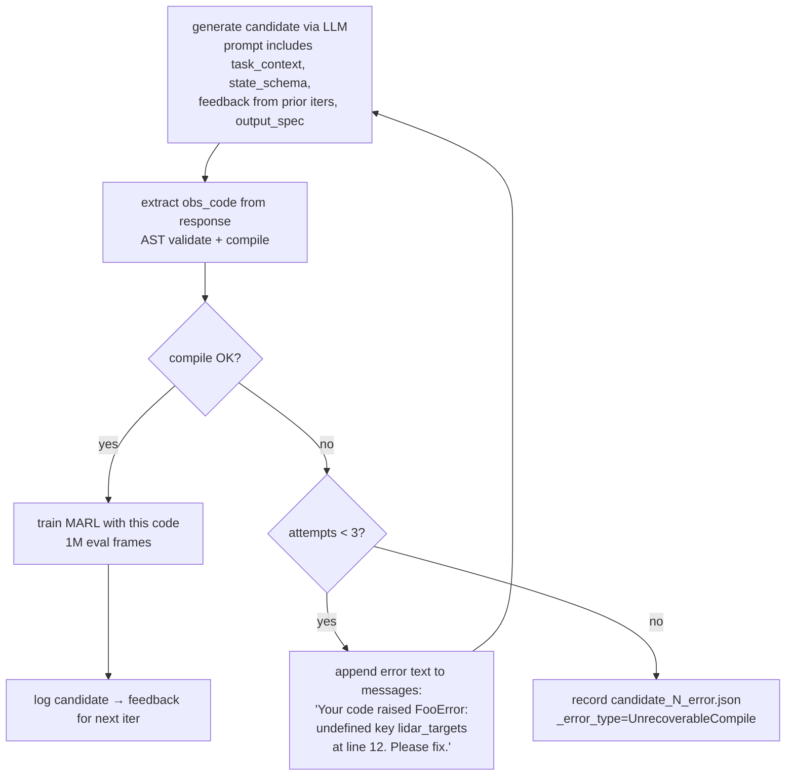

# LERO-MP v3 — Inner-LLM Hardening, TextGrad Meta-Critique, Reproducibility

> **Status:** Plan for review — 2026-04-24.
> **Replaces:** the 2026-04-24 earlier v3 draft (which focused exclusively on meta-LLM behavioral signals).
> **Rationale for rewrite:** v2.1 review revealed the biggest unaddressed lever is the **inner LLM** — the one that actually writes the `enhance_observation` / `compute_reward` code the RL policy trains on. v3 is now inner-first, with meta-LLM improvements layered on top.

---

## 0. TL;DR of what changed from the earlier v3 draft

| Earlier v3 | New v3 |
| --- | --- |
| Behavioral signals only to meta-LLM | Behavioral signals to **both** meta-LLM and inner-LLM's between-iter feedback |
| No inner-LLM retry on errors | **Inner-LLM retry loop** (3 attempts, error traceback fed back) |
| Inner LLM still generates `compute_reward` when `evolve_reward=false` (~40% token waste) | **Conditional template**: compute_reward signature removed when not needed |
| Regex parsing for meta + inner outputs | **Pydantic structured outputs** for both meta and inner LLM calls |
| Meta-LLM Editor emits one shot | **TextGrad-style Editor self-critique** — 1–2 critique-revision rounds |
| Temperature hand-tuned per LLM (0.8 inner, 0.1–0.7 meta) | **Temperature=1.0 default for all LLMs**; diversity comes from prompt/data, not sampling |
| Reproducibility as §10 | Same — caching + openai seed + fingerprint + RNG locks |
| Cross-run memory in §11 | Same — `max_outer_iters=4` + mounted prior-sweep bucket |

The re-framing keeps everything valuable from the old draft but reorders priorities and adds concrete new features.

---

## 1. Motivation

v2.1 shipped a working two-level meta-prompt pipeline but produced **0 marginal_improvement verdicts** across 6 mutations. Deep review surfaced three structural issues:

1. **The inner LLM is brittle.** Candidate generation fails silently (e.g. shape mismatches, missing state keys) — those failures count as `_error` but never get a second chance. When ~30% of candidates fail and the evaluator just picks among successes, we're cutting the selection pressure the evolutionary loop depends on.

2. **The inner LLM generates unused code.** With `evolve_reward: false`, the LLM still emits a `compute_reward(...)` block that gets saved and discarded. ~40% of output tokens, ~40% of the LLM's attention, thrown away.

3. **The meta-LLM's Editor is a single-shot write.** It may slip past the fairness-restatement guard, miss a focus item, or produce generic text. One LLM call, one chance — no self-review.

v3 addresses all three directly. Structural stability (deterministic outputs, typed IO) lets us run everything at temperature=1.0 without reproducibility concerns. Evolution is still LLM-driven but driven by *prompt + data + memory*, not by re-rolling the same prompt.

---

## 2. Design principles

- **Structural stability over sampling randomness.** Temperature=1.0 everywhere. Diversity comes from *different inputs* (different candidates, different mutation history, different prior-slot versions), not from *same input + different sampling*.
- **Fail loud, retry fast.** A failed candidate gets 3 attempts with its own error as feedback before being labelled `_error`. Same for malformed meta-LLM outputs.
- **Typed I/O.** Pydantic schemas + OpenAI structured outputs kill format drift. `MutationParseError` stops being a recurring failure mode.
- **Two-role reasoning for the Editor.** The Editor proposes; a Critic reviews; the Editor revises. TextGrad-style convergence in 1–2 rounds.
- **Inner and meta share infrastructure** (cache, seed, fingerprint logging). Reproducibility is a system-level property, not per-LLM.
- **Don't change RL training.** MAPPO, BenchMARL, the scenario patch — all untouched. v3 is pure prompt-level work + light reproducibility plumbing.

---

## 3. Inner-LLM improvements (the primary v3 thrust)

> **v4 DSPy readiness (carried through v3):** the inner LLM, the Editor, and the Critic are each extracted as standalone callables (`src/lero/inner_llm.py::InnerLLM.generate`, `meta/mutation.py::Editor.generate`, `meta/critique.py::Critic.generate`). Each returns a Pydantic instance. In v4 this becomes `dspy.Module.forward` — no refactor, just a base-class swap.

### 3.1 Retry loop with error feedback

**Problem**: today, if the LLM emits code that fails at compile/AST-validate/runtime, we log `_error` and move on. The LLM never sees its own mistake. A reasonable error is wasted.

**Change**: wrap candidate generation in a retry loop (max 3 attempts). On each failure, append the compiler/runtime error message to the conversation and ask the LLM to fix it.



**Implementation sketch** (in `loop.py` `_evaluate_candidate`):

```python
MAX_GEN_ATTEMPTS = 3

def generate_valid_candidate(llm, base_messages):
    messages = list(base_messages)
    last_error = None
    for attempt in range(MAX_GEN_ATTEMPTS):
        response = llm.generate(messages, n=1)[0]
        try:
            code = extract_candidate_code(response)
            validate_ast(code, allowed=["torch", "math", "F"])
            compile(code, "<candidate>", "exec")
            return CandidateCode(obs_source=code, attempts=attempt + 1, raw_response=response)
        except (ExtractError, ValidationError, SyntaxError) as e:
            last_error = e
            messages.append({"role": "assistant", "content": response})
            messages.append({"role": "user", "content": (
                f"Your previous output could not be used: {type(e).__name__}: {e}\n"
                f"Please return ONLY a fixed Python function that addresses this error."
            )})
    raise CandidateGenerationFailed(f"Max retries exceeded; last error: {last_error}")
```

**Scope**: applies to `enhance_observation` extraction + compilation. Runtime errors during RL training still mark the candidate as failed (we can't retry mid-training).

**Expected effect**: candidate valid-rate goes from ~70% to ~95% per inner iteration. More candidates means more selection pressure means better evolution.

**Test plan**:
- Stub LLM that returns malformed code on attempt 1, valid on attempt 2 → retry succeeds, `attempts=2` recorded.
- Stub LLM that always returns malformed code → raises after 3 attempts.
- Multi-round conversation format verified.

### 3.2 Conditional output schema — drop reward codegen when unused

**Problem**: v2_fewshot_modular_v2/output_spec.txt unconditionally asks for both `compute_reward` and `enhance_observation`. With `evolve_reward=false`, the reward code is silently discarded. ~40% of tokens wasted.

**Change**: `LeroConfig` exposes `evolve_reward` and `evolve_observation` already. At template-render time, inspect these flags and omit the unused signature from the prompt:

```text
## Generate Functions


def compute_reward(scenario_state: dict) -> torch.Tensor:
    ...



def enhance_observation(scenario_state: dict) -> torch.Tensor:
    ...


Wrap each in a separate ```python block.
```

Implementation: add `evolve_reward` / `evolve_observation` as `string.Template` substitution variables (via a small preprocess step since `string.Template` doesn't natively support conditionals), OR: maintain three output_spec variants (`output_spec_both.txt`, `output_spec_reward_only.txt`, `output_spec_obs_only.txt`) and switch at load time. The latter is 10 lines.

**Expected effect**: inner-LLM generation latency drops ~30%. Candidate files cleaner (no fake reward_code). Inner LLM's attention focused on the function that actually matters.

### 3.3 Structured outputs via Pydantic

**Problem**: `extract_candidates` in `codegen.py` uses regex to pull ```python ... ``` blocks out of freeform LLM responses. Fragile to LLM formatting drift.

**Change**: use OpenAI's structured-output API (`response_format={"type": "json_schema", "json_schema": ...}`) with a Pydantic model:

```python
class InnerLLMOutput(BaseModel):
    """Schema the inner LLM must fill in."""
    obs_code: str = Field(description="Complete enhance_observation(...) function body")
    reward_code: Optional[str] = Field(None, description="Complete compute_reward(...) body, only if asked")
    rationale: Optional[str] = Field(None, description="1-2 sentence summary of what this observation encodes")
```

LiteLLM supports structured outputs on OpenAI providers since `litellm>=1.50`. The response is a validated Pydantic instance, not a string.

**Expected effect**: `ExtractError` and similar parsing-related `_error_type` tags disappear. One less retry cause. One less class of failure.

**Test plan**:
- Mock LLM returning valid structured output → InnerLLMOutput instance.
- Mock LLM returning invalid (schema violation) → Pydantic raises → caught by §3.1 retry loop.

### 3.4 Behavioral signals in between-iteration feedback

**Problem**: `codegen.build_feedback` currently shows top-k candidates with M1/M2/M6 scalars. The inner LLM never sees:
- Collision counts (M4) — a pile-up signal
- Spatial spread (M9) — clustering signal
- Agent utilization CV (M8) — role-uneven signal
- Learning-curve shape tag — monotonic vs oscillating vs collapse
- Behavioral fingerprint — coverage timeline, terminal configs, target-utilization histogram

**Change**: extend `build_feedback` to surface these signals per candidate. Same Tier 1 / Tier 2 / Tier 3 structure as the meta-LLM prompt (see §4.1) but placed in the inner-LLM's inter-iteration feedback instead of just the meta prompt.

**Gated by `include_signals`** (see §4.1) — if the most recent StrategyCard dropped `fingerprint` or `curve_shape`, the inner-LLM feedback drops them too. Default on first inner iteration (no Strategy yet) = `["scalar"]` only; other tiers unlock once the meta-LLM requests them. Keeps noise down when signal value is unknown.

**Expected effect**: the inner LLM can now react within a single inner-loop run to behavioral failures. "Iter 1 candidates piled up (M4=210/episode). Iter 2: try features that expose teammate-crowding, e.g. `proximity_count`." Previously only the meta-LLM got to see this, and only between outer iters.

### 3.5 Temperature=1.0 + structured outputs

**Problem**: today inner LLM runs at `temperature=0.8` for diversity. With caching off (reproducibility default), re-running loses those exploratory candidates.

**Change**: set `temperature=1.0` (OpenAI recommended for structured-output endpoints). Since the output shape is now Pydantic-validated, "diversity" in sampling can't produce malformed output. Content variance is natural-language variance, not structural.

Combined with §3.1 retry loop: even if T=1.0 occasionally produces code that doesn't compile, it gets 3 shots with error feedback to fix it.

**Expected effect**: more diverse candidate features across iterations, fewer "same 3 ideas over and over" issues we saw in v2.1 where seed 0 and seed 2 wrote near-identical observation functions.

---

## 4. Meta-LLM improvements

### 4.1 Behavioral signals in Strategist + Editor prompts (Tier 1/2/3) with LLM-driven gating

Moved from the old v3's §3. Same three tiers as before:

- **Tier 1** — M3/M4/M8/M9 scalar extras in `_candidate_spread()` and `_format_top_candidates()`.
- **Tier 2** — behavioral fingerprint from existing BenchMARL scalar CSVs, surfaced only for the top-1 candidate to keep prompt bounded.
- **Tier 3** — learning-curve shape tag (`monotonic_rise` / `plateau_then_collapse` / `oscillating` / `flat_zero` / `flat_nonzero` / `reward_hack_shape`).

New emphasis: these signals are computed once per inner-loop run and passed to **both** the inner-LLM's next-iter feedback (§3.4) AND the meta-LLM's Strategist + Editor. No duplicate computation.

**Two-gate noise control**:

1. **Threshold gate** (automatic): Tier 2/3 shown only when outlier (`M4>50 ∨ M9<0.2 ∨ M9>0.8 ∨ M8>0.4` or curve shape ≠ `monotonic_rise`).
2. **LLM gate** (meta-driven): the Strategist's `StrategyCard.include_signals: list[Literal["scalar","fingerprint","curve_shape"]]` declares which tiers to forward downstream. Shown = threshold-gate ∧ LLM-gate. The Critic (§4.2) can revise `include_signals` via `suggested_signal_change`.

The Strategist's own prompt always receives the full tiered feedback — only *downstream* prompts (Editor + next-iter inner feedback) get filtered. This way the Strategist is the single decision point for "what's noise vs signal this round".

### 4.2 TextGrad-style Editor self-critique

**Problem**: the Editor is a single-shot write. Common failure modes:
- Produces text that reads like a fairness-slot paraphrase.
- Forgets to name a specific feature the Strategist's `focus` asked for.
- Writes good content but of the wrong length (too short / too verbose).

The existing `_is_fairness_restatement` guard catches only egregious cases; subtler drift slips through.

**Change**: add a **Critic** pass after Editor output. The Critic is a second LLM call (same model, but focused on review). It sees:
- Strategist's StrategyCard (focus/avoid/target_slot)
- Fairness slot (for restatement detection)
- Editor's proposed new slot text
- Prior-slot versions (to check for diversification)

Critic outputs a structured `EditorCritique`:

```python
class EditorCritique(BaseModel):
    addresses_focus: bool
    addresses_focus_reason: str
    cites_specific_features: list[str]  # feature identifiers found in the text
    has_fairness_restatement: bool
    has_fairness_restatement_reason: str
    diverges_from_priors: bool
    suggested_edits: list[str]  # specific text-level changes
    suggested_signal_change: Optional[Literal["add_fingerprint","drop_curve_shape","drop_fingerprint","keep"]] = "keep"
    overall_quality: Literal["keep", "revise", "reject"]
```

If `overall_quality == "keep"`: accept Editor output.
If `overall_quality == "revise"`: re-invoke Editor with the Critic's suggested_edits appended to its context. Max 2 revision rounds.
If `overall_quality == "reject"`: raise `MutationParseError`, outer loop graceful-stops (same as today).

**Cost**: +1–2 LLM calls per mutation. At gpt-5.4-mini prices: ~$0.01 per mutation extra. Negligible.

**Inspiration**: TextGrad ([Nature 2024, Yuksekgonul et al.](https://arxiv.org/abs/2406.07496)) — treats LLM critiques as textual "gradients" that flow back to improve the output. Empirically converges in 1–2 rounds on well-scoped tasks.

**Test plan**:
- Stub LLM returns bad Editor output → Critic flags → revise → accepted.
- Stub Editor always returns bad → Critic rejects after max revisions → MutationParseError.
- Critic's structured output validated by Pydantic.

### 4.3 Prior-slot-version block activation

Moved from old §11. Requires `max_outer_iters=4` so a second mutation on the same slot sees the first's verdict in its `prior_slot_versions` block. Config change only, no code change (the plumbing is in v2.1).

---

## 5. Reproducibility — deterministic replay of runs

Moved from old §10 with identical content. Five fixes ordered by leverage:

### 5.1 LLM-call cache (toggleable, 4 modes)

Exactly as before — `off` / `read_write` / `read_only` / `write_only` via `meta_prompt.llm_cache` + `LERO_LLM_CACHE_MODE` env var. Default `off`. Applies to **both** inner and meta LLM calls (same `LLMClient` abstraction). Cache key: `sha256(model, messages, temperature, openai_seed)` — since `openai_seed` is now derived per candidate (§5.2), sibling candidates within one `llm.generate(n=3)` batch have distinct cache keys and don't collide.

### 5.2 OpenAI `seed` parameter

Pass `seed = int(sha256(run_id, outer_iter, inner_iter, candidate_idx, level).hexdigest()[:8], 16) % 2**31` to every chat-completion. Reproducible but decorrelated per call. **Per-candidate derivation is required**: without `candidate_idx` in the key, `llm.generate(n=3)` would return the same text 3× at temp=1.0 with OpenAI seeding enabled. Applies to BOTH inner and meta LLM calls — `level ∈ {"inner", "strategist", "editor", "critic"}`.

### 5.3 `system_fingerprint` logging

Log OpenAI's `system_fingerprint` alongside each response. Lets us detect silent model-version drift.

### 5.4 Torch/numpy/random seed lock

At `run_lero_mp.py` startup:

```python
random.seed(args.seed)
np.random.seed(args.seed)
torch.manual_seed(args.seed)
torch.cuda.manual_seed_all(args.seed)
```

### 5.5 Pin all dependency versions (deferred — v4.5)

Deferred — not blocking for v3 dry-run. Requires Docker image freeze; see §11 v4.5.

---

## 6. Exercising prior-mutation memory

Moved from old §11. Two fixes:

### 6.1 Bump `max_outer_iters` to 4

Config change in `mp_quick_v2_k2_cr035.yaml`. Gives the outer loop 4 records → 2nd mutation sees 1st's verdict via `prior_slot_versions`.

### 6.2 Cross-run memory via mounted prior-sweep bucket

Extend `submit_training_job` to accept `history_buckets: List[str]`. Run mounts them read-only. `outer_loop` scans mounted paths for `mutation_log.jsonl` and passes them to `read_recent()` (already supports multi-path).

---

## 7. What v3 deliberately does NOT add

(Scope exclusions apply to v3 only; v7+ may relax them.)

- **Per-step trajectories in LLM prompts.** Ruled out for v3 — LLMs reason badly over raw sequences of 800 floats.
- **Pixel video inputs.** Same reason. Videos stay as human-only post-hoc debug (`scripts/review_run.py`).
- **Hard-coded decision rules** ("if M4 > 100 force reward slot"). v3 stays LLM-driven.
- **RL-training changes.** MAPPO, BenchMARL, VMAS scenarios — all untouched by v3. (v7's TextGrad-on-code would reintroduce mini training evals, but that's out of scope here.)
- **Multi-provider abstraction.** Keep LiteLLM + OpenAI. Switch to Anthropic when their structured-outputs story matures (currently LiteLLM does schema validation client-side for Claude, which defeats the purpose).

---

## 8. Implementation plan

### Step 1 — Inner-LLM retry loop (2 h) — §3.1

- Wrap `_evaluate_candidate` call to `llm.generate` in a retry loop with error feedback.
- Record `attempts` on `CandidateCode`.
- `test_lero_retry.py`: 3 scenarios (pass-on-first, pass-on-retry, exhaust-retries).

### Step 2 — Conditional output_spec (20 min) — §3.2

- Add three output_spec variants under `v2_fewshot_modular_v2/`.
- Loader picks one based on `(evolve_reward, evolve_observation)`.
- Test: render-matches for each of the four combinations.

### Step 3 — Inner + Meta structured outputs (3 h) — §3.3 + §4.2 Critique

- Pydantic models: `InnerLLMOutput`, `StrategyCard` (already exists, migrate), `EditorOutput`, `EditorCritique`.
- `LLMClient.generate_structured(messages, schema)` helper using LiteLLM + OpenAI json_schema.
- Replace regex parsing in `codegen.extract_candidates`, `mutation.parse_mutation_response`, `strategy.parse_strategy_card`.
- Tests: each schema valid/invalid roundtrip.

### Step 4 — Temperature=1.0 default (15 min) — §3.5

- `LeroConfig.temperature: 1.0` default (was 0.8).
- `MetaPromptConfig.meta_temperature: 1.0` default (was 0.3).
- Update `SEED_META_TEMPERATURE` cycle: keep as override knob but unused by default.

### Step 5 — Behavioral signals — Tier 1 + 2 + 3 (2.5 h) — §4.1 + §3.4

- `src/lero/meta/behavioral_summary.py` (Tier 2 fingerprint from BenchMARL CSVs).
- `mutation_log.classify_learning_curve(trajectory) -> str` (Tier 3).
- Extend `_candidate_spread()` and `codegen.build_feedback` to include all tiers.
- Adaptive gating (Option A): outlier thresholds `M4>50 / M9<0.2 / M9>0.8 / M8>0.4`.
- Tests: synthetic CSVs → expected fingerprint.

### Step 6 — TextGrad Editor self-critique (3 h) — §4.2

- `src/lero/meta/critique.py`: `build_critic_prompt`, `parse_critique`, `critique_and_revise`.
- Loop: Editor → Critic → maybe revise → Critic → maybe revise → accept or MutationParseError.
- Max 2 revisions.
- Tests with stub LLMs covering keep / revise / reject paths.

### Step 7 — Reproducibility (1.5 h) — §5

- `src/lero/llm_cache.py` with 4 modes.
- Thread `openai_seed` + `system_fingerprint` through `LLMClient`.
- Seed-lock in `run_lero_mp.py` startup.
- Tests: cache hit/miss/key-variation, mode transitions.

### Step 8 — Prior-memory activation (20 min) — §6

- `max_outer_iters: 4` in `mp_quick_v2_k2_cr035.yaml`.
- `submit_training_job(history_buckets=[...])` parameter.
- `run_lero_mp.py` scans mounted history paths on startup.

### Step 9 — Local review script (1 h)

- `scripts/review_run.py` for human-side video rendering of peak-M1 policies. NOT in the OVH loop.

### Step 10 — Dry-run on OVH (v3 validation at 3M, 2–3 metaprompts, ER1-comparable)

- Fire 3-seed v3 config at **3M full_frames** with `max_outer_iters=3` (produces 2–3 mutations per seed — enough to exercise `prior_slot_versions`).
- Task params mirror ER1/ER2/ER3/S3b-local at `n=4 t=4 k=2 cr=0.35 ms=200` for direct peak-M1 comparability.
- **Artifact assertions** via `scripts/review_dry_run.py`:
  - `attempts > 1` recorded on ≥1 successful candidate (retry salvage).
  - Strategist `rationale` contains digit-pattern `M(4|8|9)=\d+` at least once.
  - Critic `overall_quality` = "revise" at least once.
  - `mutation_log.jsonl` has ≥1 `marginal_improvement` or `strong_improvement` verdict.
  - Seed 0 `read_only` cache replay matches bit-exact (rerun same seed with cache=read_only).
- **Local pre-flight**: `tests/test_lero_mp_integration.py` runs 1 outer × 1 inner × 50k-frame loop with stub LLM (~5–10 min, runs in CI-like conditions).
- **Checklist doc**: `docs/lero_v3_dryrun_checklist.md` — manual grep commands + expected artifact shapes.

**Total implementation time**: ~14 h including tests.
**Total compute**: ~€22–30 for v3 dry-run (3 seeds × 3M frames).

---

## 9. Success criteria (make/break before full 10M run)

Need at least 3 of these 5 firing:

1. **Inner-LLM retry loop salvages ≥ 20% of would-be-failed candidates.** Recorded `attempts > 1` on a meaningful fraction of successful candidates.
2. **Strategist `include_signals` is non-default AND rationale cites a behavioral signal by value** in at least one seed (e.g. `include_signals=["scalar","fingerprint"]` with rationale "M4=68 on best-M6 candidate → add repulsion feature").
3. **Editor self-critique triggers a revision** at least once — validates the TextGrad pattern is working.
4. **At least one mutation scores `marginal_improvement`** at 3M (vs 0 of 6 at 1M today).
5. **Re-running seed 0 with `llm_cache=read_only`** from a prior run reproduces the same StrategyCard + Editor output bit-exact.

If fewer than 3 fire, v3 didn't clear the bar. Iterate on presentation before committing to €76 of 10M training.

---

## 10. Open questions for review

- [ ] Option A vs B vs C for adaptive metric selection? (A — fixed tiered with outlier gating — remains my recommendation.)
- [ ] Tier 2 fingerprint on top-1 only vs top-3? (top-1, budget.)
- [ ] Inner-LLM retry max: 3 attempts or 5? (3 — LLM rarely fixes errors beyond retry 3 based on anecdotal evidence.)
- [ ] Critic LLM: same model as Editor (gpt-5.4-mini) or a cheaper/faster one? (Same for simplicity; revisit if latency becomes an issue.)
- [ ] LLM-cache default mode: `off` or `read_write`? (`off` — prevents accidental replay on fresh experiments.)
- [ ] Temperature=1.0 for inner LLM: safe with structured outputs? (Yes, per OpenAI docs; the schema constrains shape.)
- [ ] Critic revision max: 2 rounds or unlimited until accepted? (2 — if it can't be fixed in 2 rounds, the Editor probably needs a different Strategy.)

---

## 11. Forward direction — beyond v3

**v4 — DSPy Signatures (~2 days)**
Wrap Strategist, Editor, Critic, InnerLLM as `dspy.Signature` subclasses. Runtime identical but optimizer-ready.

**v4.5 — Docker dependency freeze (~1 day)**
Pin `litellm`, `openai`, `pydantic`, `torch`, `benchmarl`, `vmas` in a Docker image. Required before v5+ so compiled prompts don't silently drift when a dependency auto-upgrades on OVH. Fulfills §5.5.

**v5 — MIPROv2 compilation (~1 day once trainset ready)**
After ≥ 20 mutations accumulated in the cross-run log with known verdicts, run `MIPROv2.compile(Strategist, trainset, metric=verdict_score)` offline. Output: a compiled prompt tuned against our own mutation history. Re-run gives same decision deterministically; caching becomes optional.
*Trainset footnote*: v3 dry-run produces ~9 mutations (3 seeds × max_outer_iters=3). One full 3M run plus one 10M run = ~18 mutations. So v5 is realistically ~2 full runs away.

**v6 — Compile the inner LLM too**
Once meta-LLM is compiled, harvest `(feedback_state → good_candidate_code)` pairs from runs. MIPROv2 on the inner-LLM signature. This is where the biggest RL impact likely lives — better candidate features → better policies.

**v7 — TextGrad on code (further out)**
Apply TextGrad-style gradients to the inner LLM's candidate code: compile, run a tiny 100k-frame sanity eval, if `M6 == 0` let a Critic LLM propose specific code edits, re-submit. Converges on candidates that at least *move the agents*. Expensive (each iteration is a mini-training) but worth trying once the base pipeline is stable.

---

## 12. Files to add / change

New files:
- `src/lero/llm_cache.py` — cache layer
- `src/lero/inner_llm.py` — standalone InnerLLM callable (v4 DSPy-ready)
- `src/lero/meta/critique.py` — Editor Critic + revision loop
- `src/lero/meta/behavioral_summary.py` — Tier 2 fingerprint from CSVs
- `src/lero/schemas.py` — Pydantic models (InnerLLMOutput, StrategyCard, EditorOutput, EditorCritique)
- `scripts/review_run.py` — local video rendering
- `scripts/review_dry_run.py` — parses $RESULTS_DIR and prints pass/fail per §9
- `scripts/clear_llm_cache.py` — cache reset helper
- `docs/lero_v3_dryrun_checklist.md` — manual grep checklist

Changed files:
- `src/lero/llm_client.py` — structured-output + seed + fingerprint
- `src/lero/loop.py::_evaluate_candidate` — retry loop wrapping
- `src/lero/codegen.py` — replace regex with Pydantic
- `src/lero/meta/mutation.py` — Editor + Critic integration, prior_slot_versions use
- `src/lero/meta/outer_loop.py` — thread behavioral signals into inner-loop feedback, handle cross-run memory
- `src/lero/meta/strategy.py` — structured output, accept behavioral-fingerprint input
- `src/lero/meta/mutation_log.py` — `classify_learning_curve`, verdict-scale threading (already in)
- `src/lero/prompts/v2_fewshot_modular_v2/output_spec_{both,reward_only,obs_only}.txt` — conditional schemas
- `configs/lero_mp/mp_quick_v2_k2_cr035.yaml` — `max_outer_iters=4`, `temperature=1.0`
- `src/ovh.py` — `history_buckets` param
- `run_lero_mp.py` — RNG lock at startup, cross-run bucket scan

Test files:
- `tests/test_lero_retry.py` — retry loop unit tests
- `tests/test_lero_mp_critique.py` — critique-revise loop
- `tests/test_lero_mp_behavioral.py` — fingerprint computation
- `tests/test_lero_schemas.py` — Pydantic roundtrips
- `tests/test_lero_mp_repro.py` — cache + seed + fingerprint + per-candidate
- `tests/test_lero_mp_signal_gate.py` — include_signals filter
- `tests/test_lero_mp_integration.py` — end-to-end stub LLM + 50k VMAS frames
- `tests/test_lero_mp_prior_memory.py` — cross-run log + prior_slot_versions
